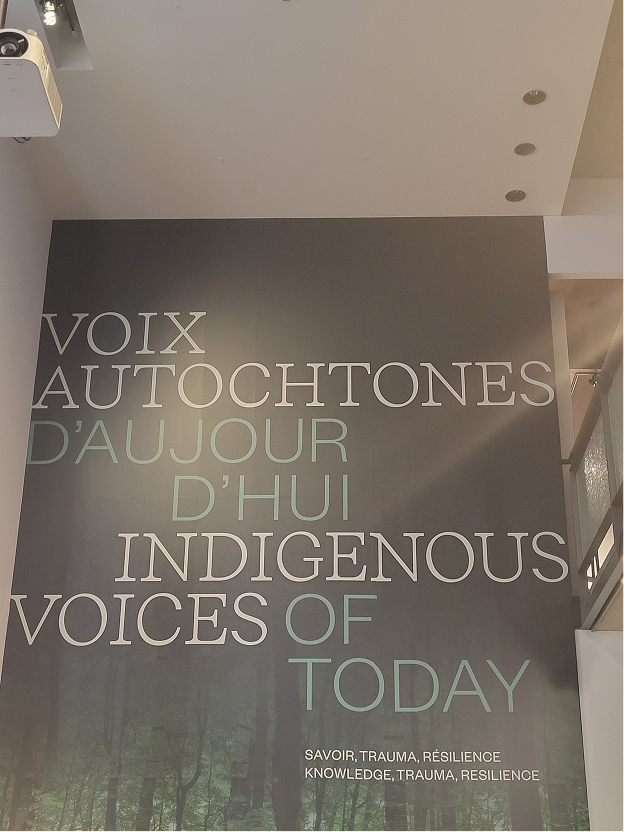
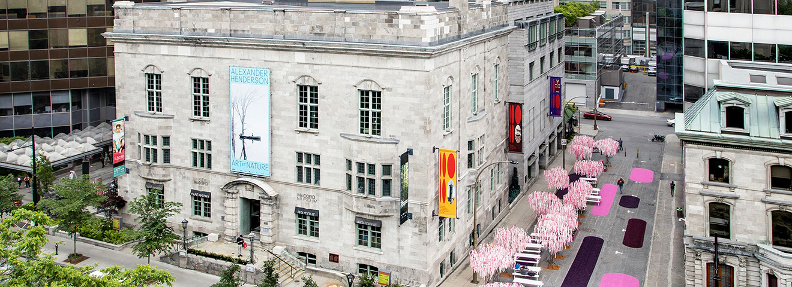
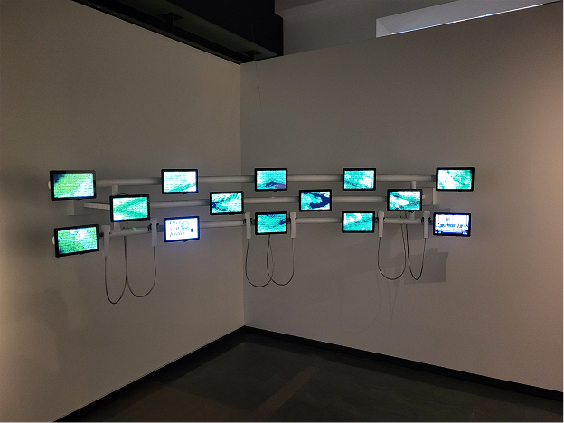
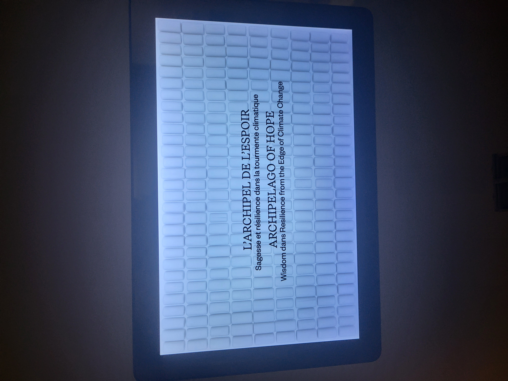
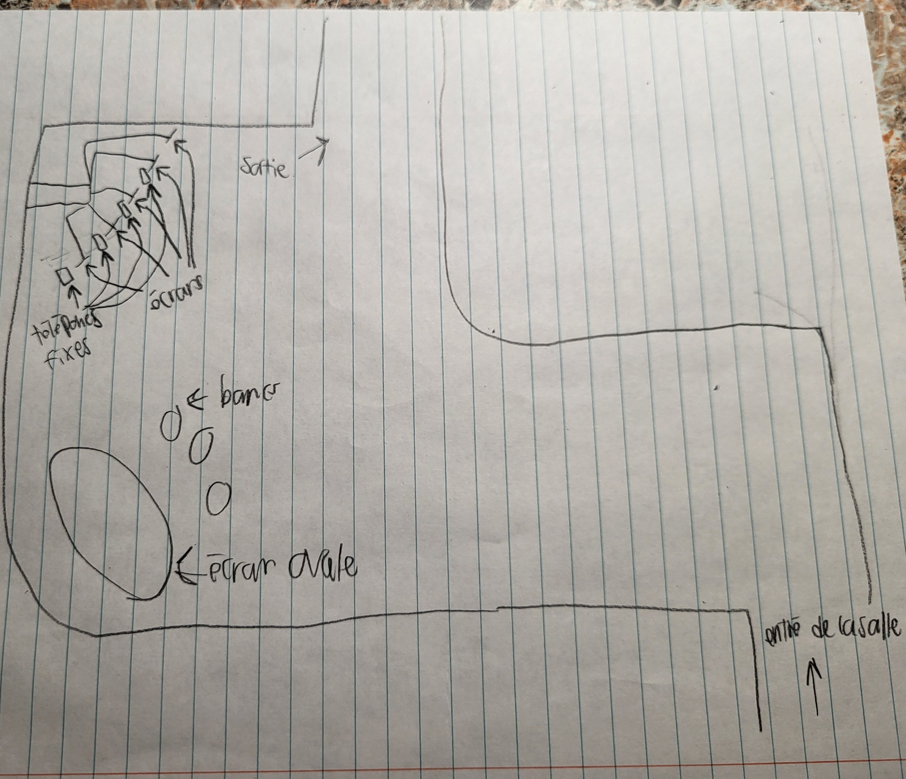
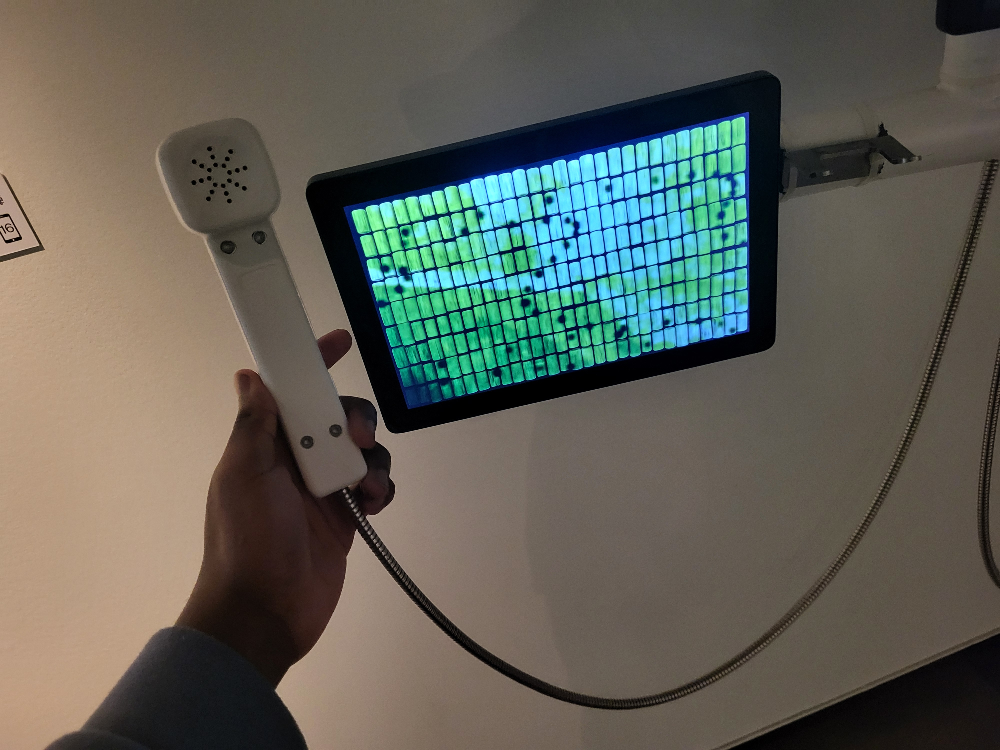
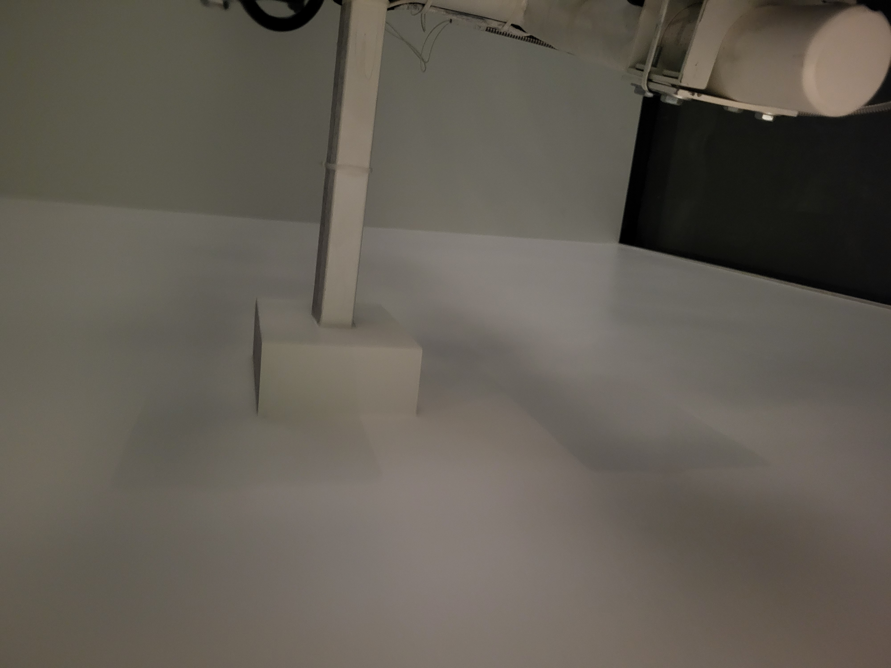
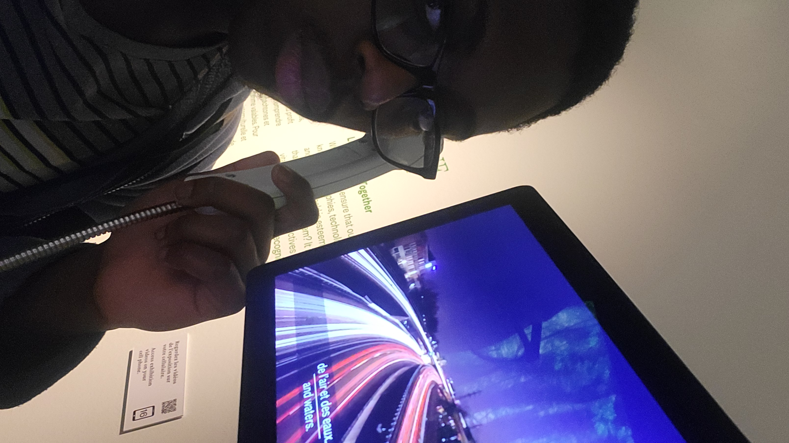

# Fiche sur le dispositif « Mawlukhotine » de l'exposition « Voix autochtones d'aujourd'hui - Savoir, Trauma, Résilience ».

>Photo de l'affiche de l'exposition à l'intérieur du musée. Photo prise par moi.

## Lieu de la mise en exposition
Musée McCord Stewart, Montréal.

>Photo prise par le musée McCord Stewart.

## Type d'exposition
Exposition permanente.

## Date de la visite
28 février 2026.

## Titre du dispositif
Mawlukhotine.

>Photo d'ensemble du dispositif. Photo prise par moi

## Nom de la firme
L'exposition fut réalisé par le musée McCord Stewart.

## Année de réalisation
2021.

## Descrition du dispositif
Plusieurs vidéos jouent sur les écrans à différents moments, il faut prendre l'un des téléphones blancs pour pouvoir entendre les sons de ceux-ci. Les vidéos racontent les divers projets et histoires que les autochtones font et vivent. Ils racontent aussi leurs conditions de vie.

>Photo de l'un des écrans du dispositif. Photo prise par moi.

## Type d'installation
Permanante.

## Fonction du dispositif multimédia
Instruire les spectateurs sur ce que les communautés autochtones font comme projets en utilisant la technologie d'aujourd'hui.

## Mise en espace

>Croquis de la mise en espace du dispositif. Photo prise par moi.

## Composantes du dispositif
Plusieurs petits écrans, des téléphones fixes avec lesquels on peut entendre les sont des vidéos jouant sur les écrans, un support mural.

>Photo prise par moi.

## Éléments nécéssaire à la mise en exposition
Support mural pour les écrans et les téléphones

>Photo prise par moi.

## Expérience vécue
Le dispositif est simple mais pousse quand même le spectateur à interagir avec lui car s'il veut entendre les sons des vidéos, il doit prendre le téléphone fixe correspondant lui permettant d'avoir accès à l'audio de la vidéo.

>Photo prise par moi.
>
## Ce qui m'a plus
Probablement le fait qu'on a le choix de prendre le téléphone ou non car il y a des sous-titres dans les vidéos.

## Références

[Exposition en ligne](https://expositions.musee-mccord-stewart.ca/)

[Image de la façade du musée](https://www.musee-mccord-stewart.ca/app/uploads/2022/09/mccord-stewart_facade-exterieur-henderson-2022_roger-aziz_1320x480.jpg)
