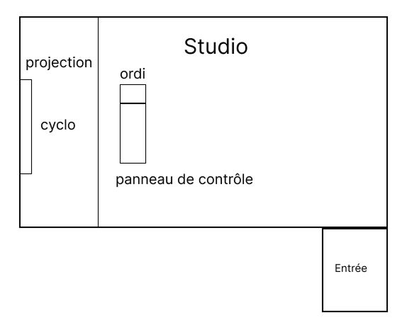

# Fiche sur le projet finissant « Mission décollage » de l'exposition « Réseau vivant »

> Photo de moi devant l'entrée de l'exposition.

# Lieu de mise en exposition
Le Collège Montmorency, Laval.

> Source: [Collège-Montmorency](https://www.cmontmorency.qc.ca/college/historique-et-logotype/evolution-identite-visuelle/).

# Type d'exposition:
Exposition temporaire.

# Date de la plus récente visite:
17 mars 2026.

# Vue d'emsemble du projet:

> Photo de l'ensemble du projet Oignon. Prise par moi.

# Nom de l'équipe: 
O.I.G.N.O.N 
## Membres:
1. Ahmed Kaissoumi.
2. Radhouane Kordan.
3. Justin Montpetit.
4. Thearylou Lach.
5. Jad Saloumi.

# Année de réalisation:
2026.

# Description du projet:

> Photo du cartel du projet. Prise par moi.

# Type d'installation:
Temporaire.

# Mise en espace:

# Composantes de l'œuvre:
## Composantes physiques:
1. Ordinateur – x1
2. Epson PowerLite 990U Projector – x1
3. Epson PowerLite 535W Projector – x2
4. Haut-parleur - x2 Utilité : Diffusion du son
5. Carte son Behringer UMC202HD - x1 Utilié : Transmettre le son aux haut-parleurs
6. Câble XLR - 4x Utilité : Connecter la carte son à l'haut-parleur
7. Contrôleur Arduino M5Stack ATOM Lite ESP32 – x2
8. Contrôleur Arduino mini – x3
9. [PBHUB] I/O Hub 1 to 6 Expansion Unit (MEGA328) – x1
10. [GROVEHUB] I/O Hub 1 to 3 Expansion Unit – x1
11. Encodeur – x3
12. BOUTON POUSSOIR (MOMENTARY) – x6
13. CÂBLE ETHERNET – x12
14. SWITCH ETHERNET – x1
15. TOGGLE SWITCH (SAFETY) - x3
16. ROTARY SWITCH - x3 
17. FADERS - x3 
18. UNIT 3.96 - x12

## Logiciels:
1. Unity
2. Pure Data
3. Visual Studio Code & PlatformIO
4. Maya / Blender
5. OBS
6. Photoshop & Illustrator
7. Reaper
8. Langages de programmation
- C# (Unity)
- C++ (Arduino)
> Source [Technique oignon](https://o-i-g-n-o-n.github.io/Mission-decollage/#/technique/)

# Éléments nécéssaires à la mise en expositions:

