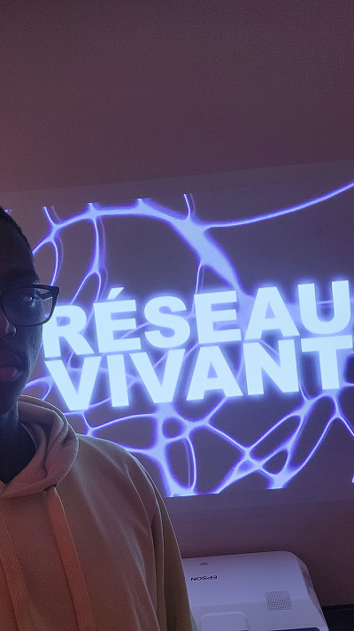
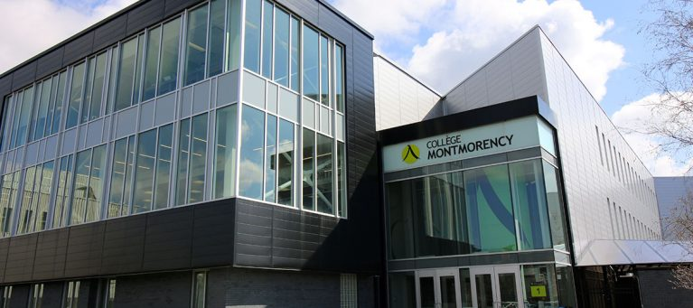
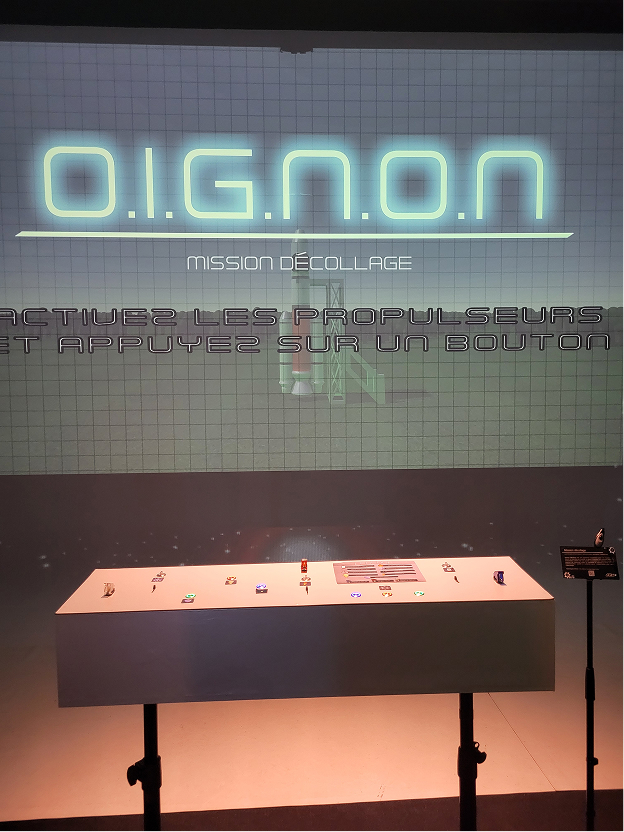
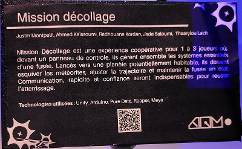

# Fiche sur le projet finissant « Mission décollage » de l'exposition « Réseau vivant »

> Photo de moi devant l'entrée de l'exposition.

# Lieu de mise en exposition
Le Collège Montmorency, Laval.

> Source: [Collège-Montmorency](https://www.cmontmorency.qc.ca/college/historique-et-logotype/evolution-identite-visuelle/).

# Type d'exposition:
Exposition temporaire.

# Date de la plus récente visite:
17 mars 2026.

# Vue d'emsemble du projet:

> Photo de l'ensemble du projet Oignon. Prise par moi.

# Nom de l'équipe: 
O.I.G.N.O.N 
## Membres:
1. Ahmed Kaissoumi.
2. Radhouane Kordan.
3. Justin Montpetit.
4. Thearylou Lach.
5. Jad Saloumi.

# Année de réalisation:
2026.

# Description du projet:

> Photo du cartel du projet. Prise par moi.

# Type d'installation:
Temporaire.

