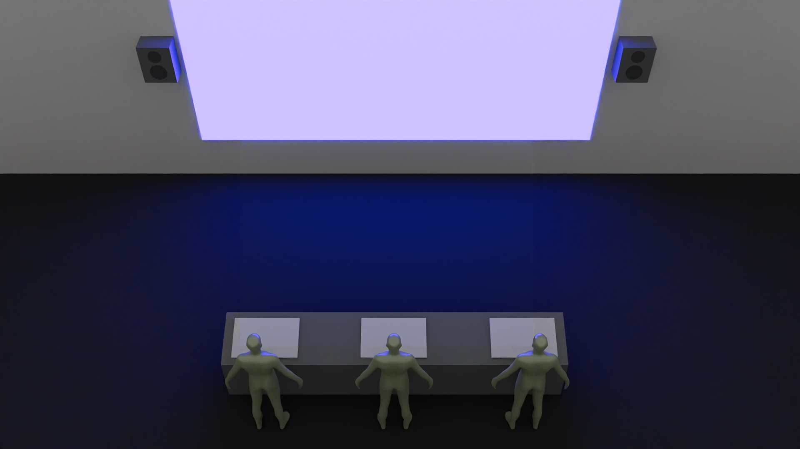
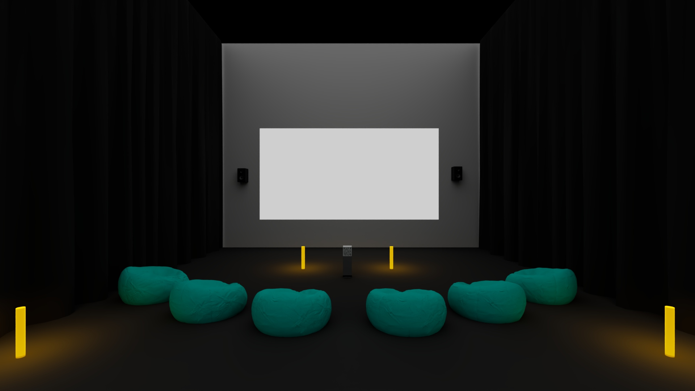
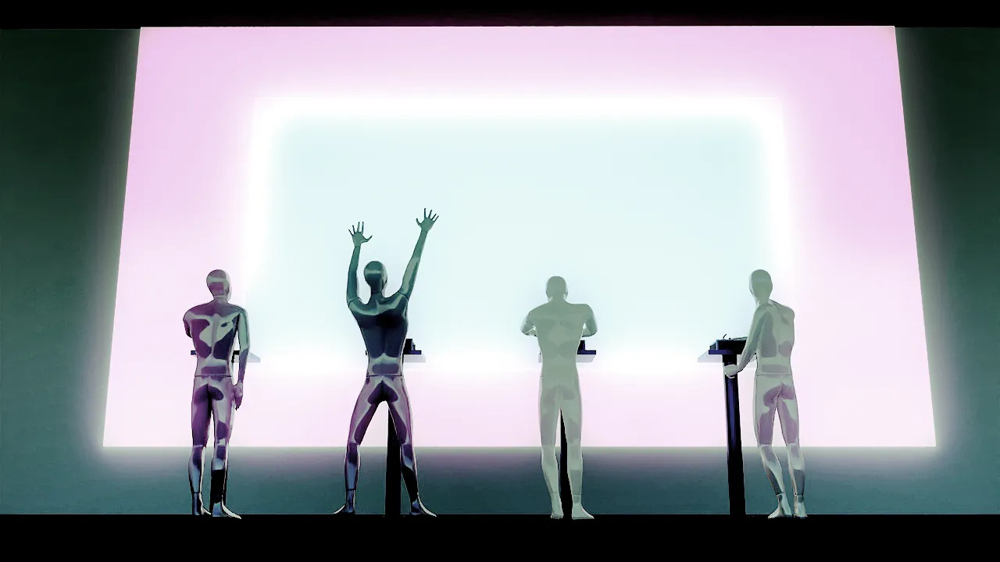

|Nom de l'oeuvre/Placement|Nom des créateurs/créatrices|Schéma de l'instalation prévue|Installation en cours (ou final)|Lien vers le site/github|
|---|---|---|---|---|
|1. O.I.G.N.O.N. Mission Décollage|Ahmed Kaissoumi, Radhouane Kordan, Justin Montpetit, Thearylou Lach, Jad Saloumi.|  |  |  |
|2. Terminal  |Émeryk Bélisle, Elie Daher, Ting Yung Lu Terry, Dana Saavedra-Torrano, Mégane Ranger.|  |  |  |
|3. Symbiose  |Yannick Chamberland, Benjamin Ferland, Ryan Dufault, Walid Cheour.  |  |  |  |
|4. Océan rouge  |Amira Tounekti, Kristy Moussally.|!  |  |  |
|5. Arbre en face  |Alexandre Gendron, Mikael Arseneau, Mathieu Willett, Matis Ghariani, Rafael Angon Dube.  |  |  |  |
|6. Quand les yeux se croisent  |Edelwyn Ledru, Félix Lavoie, Jade Hébert, Manel Yaya, Patricia Nassif.  |  |  |  |
