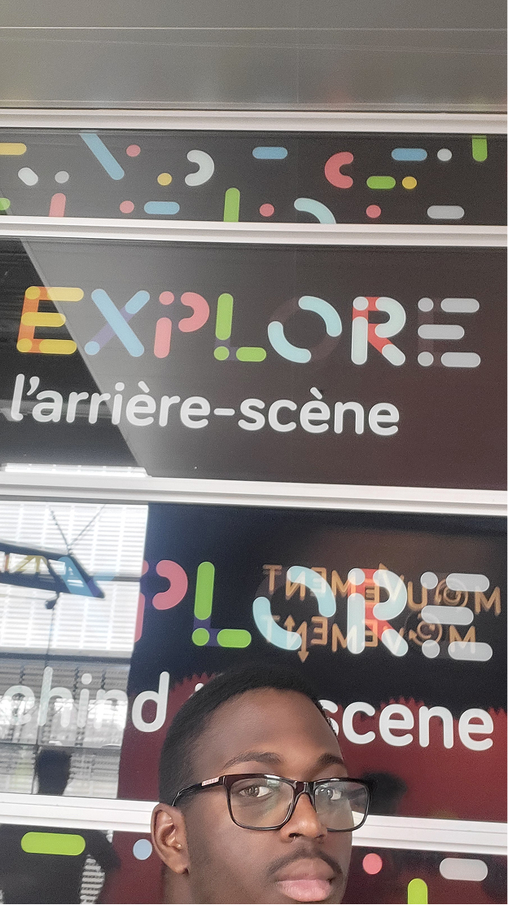
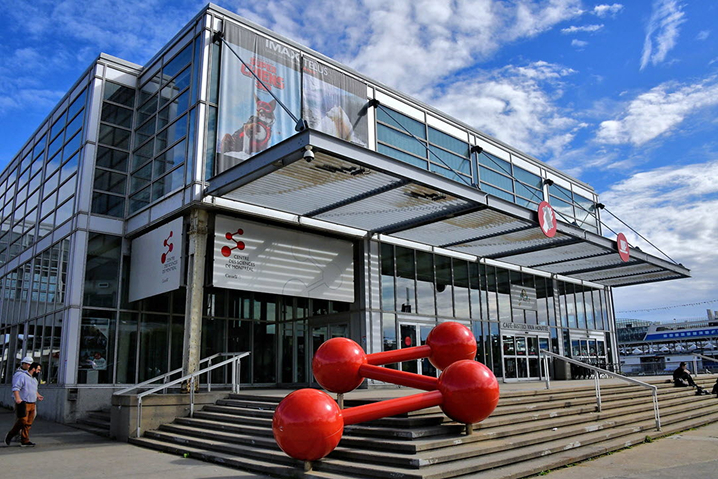
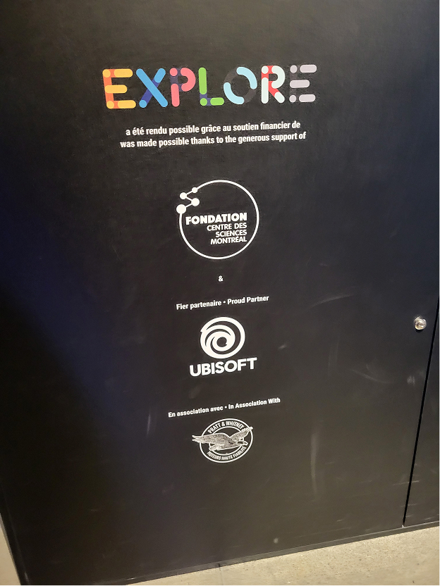
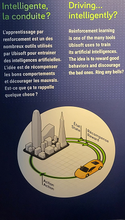
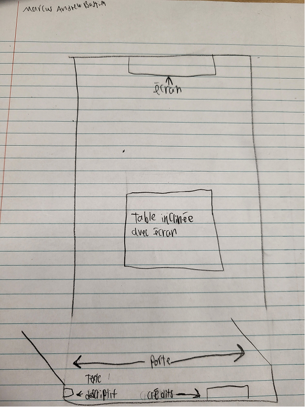
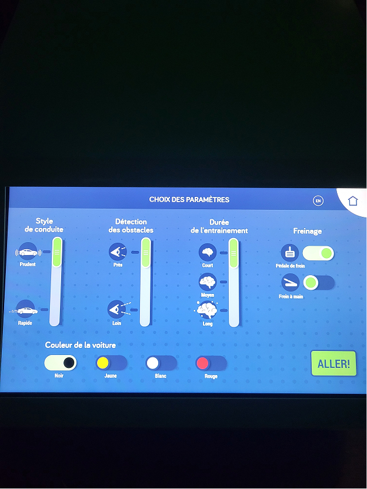
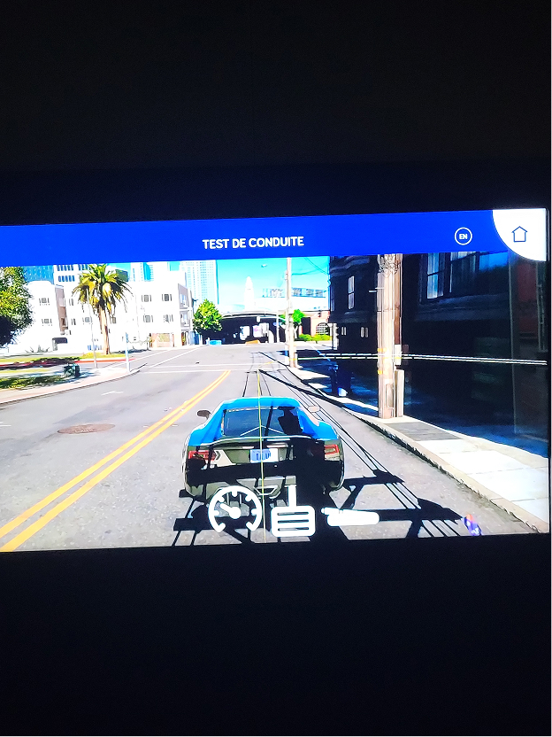

# Fiche sur le dispositif "Intelligente, la conduite?" de l'exposition "Explore - La science en grand" du Centre des Sciences de Montréal.

> Photo prise par moi.

## Lieu de mise en exposition
Centre des Sciences de Montréal.

> Source [Fusion électrique](https://fusionelectrique.com/wp-content/uploads/2021/08/centre-des-sciences-de-montreal.jpg)

## Type d'exposition
Permanante.

## Date de la plus récente visite
1er avril 2026.

## Nom de la firme et partenaire
Centre des Sciences de Montréal, en partenariat avec:

> Photo prise par moi.

## Année de réalisation de l'exposition
28 Novembre 2019
> Source: [Vieux-port de Montréal](https://www.vieuxportdemontreal.com/salle-de-presse/lexposition-interactive-explore-ouvre-ses-portes-le-28-novembre-au-centre-des)

## Description du dispositif

> Photo prise par moi.

## Type d'installation
Interactive.

## Fonction du dispositif multimédia
Instruire les jeunes sur le fonctionnement de l'IA en offrant une activité interactive amusante.

## Mise en espace

> Photo prise par moi.

## Composantes du dispositif (visible)
1. Un écran tactile incliné permettant aux utilisateurs d'intéragir avec le dispositif.
2. un grand téléviseur accroché au mur permettant aux utilisateurs de voir le résultat de leur manipulation du dispositif.

 
> Photos prise par moi.

## Ce qui m'as plus
J'ai bien aimé le fait qu'on puisse voir comment une IA réagis selon divers paramètres différent. L'interface était assez intuitive, ce qui permet à l'utilisatuer de comprendre facilement ce qui est attendu de lui.
